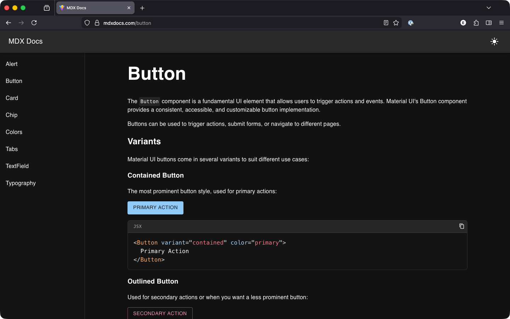

# @quietmind/mdx-docs

> ⚡ A lightweight React framework for building MDX documentation sites.

MDX Docs turns MDX files into routed documentation pages with a built-in layout, sidebar, and navigation.

MDX Docs is a React + Vite framework for building MDX-powered documentation sites. Write pages in Markdown with embedded React components, and get a fully-featured site with syntax highlighting, dark/light mode, and responsive navigation out of the box.

**Demo:** [https://mdxdocs.com/](https://mdxdocs.com/)



## Features

- MDX pages — write Markdown with embedded React components
- Syntax highlighting with copy-to-clipboard on code blocks
- Dark/light mode with system preference detection
- Responsive sidebar navigation
- Built on React 19, Material-UI 7, and Vite 6

## Quick Start

Create a new documentation site:

```sh
npx create-mdx-docs@latest my-docs
```

Create an MDX file in `pages/`:

~~~mdx
import { Button } from "@mui/material";

# Button

<Button variant="contained" color="primary">
  Primary Action
</Button>

```jsx
<Button variant="contained" color="primary">
  Primary Action
</Button>
```
~~~

Register your page in `config/pages.js`:

```js
const GettingStartedMDX = lazy(() => import("@pages/getting-started.mdx"));

export const pages = [
  // ...existing pages
  {
    name: "Getting Started",
    route: "/getting-started",
    component: GettingStartedMDX,
  },
];
```

Pages with `isDefault: true` do not appear in the sidebar navigation.

Configure your site name and description in `config/site.js`.

```js
export const site = {
  name: "My Site",
  description: "My site description",
};
```

## Favicon

Place your favicon in the `public/` directory and add a `<link>` tag to `index.html`:

```html
<head>
  <!-- ... -->
  <link rel="icon" type="image/svg+xml" href="/favicon.svg" />
</head>
```

Vite serves files in `public/` at the root path, so `public/favicon.svg` is accessible as `/favicon.svg`. Use `.ico`, `.png`, or `.svg` depending on your file.

## Project Structure

```
my-docs/
├── pages/
│   └── home.mdx
├── config/
│   ├── pages.js
│   └── site.js
├── public/
│   └── favicon.svg
├── index.html
├── main.jsx
├── vite.config.js
└── package.json
```

Vite serves files in `public/` at the root path, so `public/favicon.svg` is accessible as `/favicon.svg`. Use `.ico`, `.png`, or `.svg` depending on your file.

## Manual Installation

### 1. Install Package

```sh
npm install mdx-docs
```

## 2. Install Peer Dependencies

```sh
npm install react react-dom react-router-dom \
  @emotion/react @emotion/styled \
  @mui/material @mui/icons-material \
  @mdx-js/react @mdx-js/rollup \
  prism-react-renderer prismjs \
  vite @vitejs/plugin-react
```

### 3. `main.jsx`

```js
import "@quietmind/mdx-docs/index.css";
import { createApp } from "@quietmind/mdx-docs";
import { pages } from "./config/pages.js";
import { site } from "./config/site.js";

createApp({ pages, site });
```

### 4. `config/site.js`

```js
export const site = {
  name: "My Site",
  description: "My site description",
};
```

### 5. `config/pages.js`

```js
import { lazy } from "react";

const HomeMDX = lazy(() => import("@pages/home.mdx"));

export const pages = [
  {
    name: "Home",
    route: "/",
    component: HomeMDX,
    isDefault: true,
  },
];
```

### 6. `vite.config.js`

```js
import { defineConfig } from "vite";
import { createMdxDocsConfig } from "@quietmind/mdx-docs/vite";
import { site } from "./config/site.js";

export default defineConfig(
  createMdxDocsConfig({ rootDir: import.meta.dirname, site })
);
```

### 7. `index.html`

```html
<!DOCTYPE html>
<html lang="en">
  <head>
    <meta charset="UTF-8" />
    <meta name="viewport" content="width=device-width, initial-scale=1.0" />
    <meta name="description" content="%SITE_DESCRIPTION%" />
    <title>%SITE_NAME%</title>
  </head>
  <body>
    <div id="root"></div>
    <script type="module" src="/main.jsx"></script>
  </body>
</html>
```

## Tech Stack

- React 19, Material-UI 7, Emotion
- Vite 6, MDX 3
- React Router DOM 7
- Prism React Renderer

## Contributing

Contributions are welcome!

1. Fork the repo
2. Create a branch
3. Submit a pull request

## Related Projects

- [https://mdxjs.com/](https://mdxjs.com/)

## License

MIT
